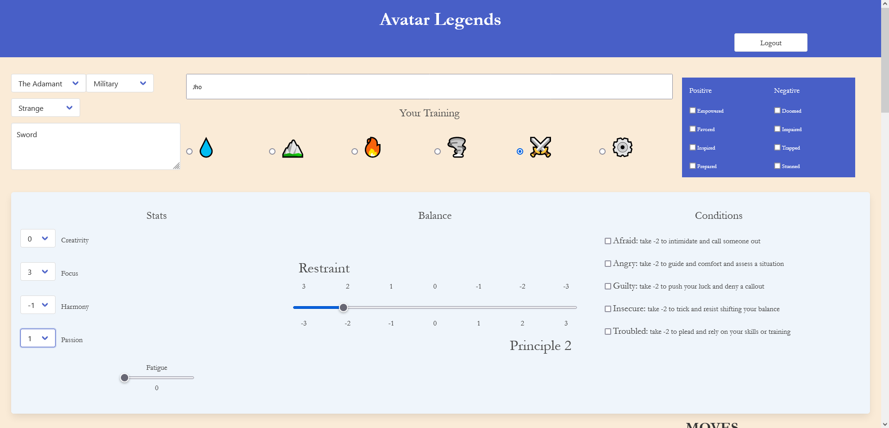

# Avatar Legends Unofficial Character Sheet

## Description

An easy way to keep track of all of your characters details. Add you playbook to get relevant information on character details and available move sets. Track you balace, conditions, positive and negative effects, stats, fatigue, and chosen moves. Record your cahracter's background info and apearance as well as your connections to the other players.

## Table of Contents

- [Installation](#installation)

- [Usage](#usage)

- [Credits](#credits)

- [License](#license)

- [Contributing](#contributing)

- [Tests](#tests)

- [Questions](#questions)

## Installation

n/a

## Usage

As a player, I want to have my character's information everywhere I go and not have to remember to bring my physical sheet to games.

## Credits

Created by CarlJMcGee

## License

[This project uses MIT License](./mit.txt)

## Contributing

[Click to see the Contributor Covenant guidelines](./code_of_conduct.md)

## Tests

n/a

## Questions?

If you have any issues, submit them to my [Github](https://github.com/CarlJMcGee)

or

If you have any other questions or inquiries, you can contact me at [carl.jack.mcgee@gmail.com](mailto:carl.jack.mcgee@gmail.com)

## Check it out >>[Here](https://avatar-charactersheet.herokuapp.com/)<<

